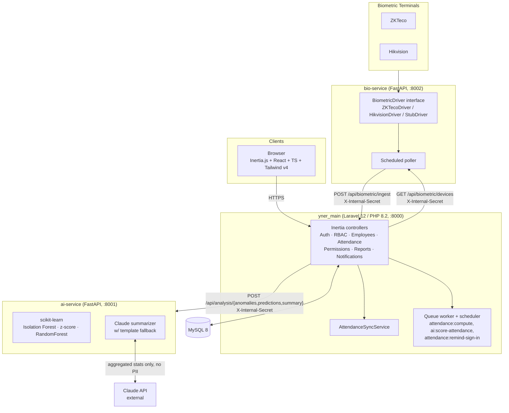

# System Architecture

Three independently deployable services, orchestrated with Docker Compose (`docker-compose.yml`
at the project root). `yner_main` is the single source of truth and the orchestrator — it is
also what starts the two Python services in local dev (`php artisan eapms:start`).

## The signed internal-REST boundary

Every cross-service HTTP call carries an `X-Internal-Secret` header set to `INTERNAL_API_SECRET`
(same value across all three services' env), verified before any handler logic runs:

- Laravel side: `App\Http\Middleware\VerifyInternalSecret` on the `verify.internal-secret`
  middleware alias, applied to `routes/api.php` (`/api/biometric/*`).
- Python side: `verify_internal_secret` FastAPI dependency (`app/dependencies.py`), applied to
  the `ai-service` `/api/analysis/*` router via `dependencies=[Depends(verify_internal_secret)]`.

This is the only trust boundary between services — there is no shared session or database
credential crossing service lines.

## Tech-stack justification

(Reproduced from `development_plan.md` — the canonical source; update there first if this
table changes.)

| Layer | Technology | Why this choice |
| --- | --- | --- |
| Frontend | Inertia.js + React + TypeScript + Tailwind v4 + shadcn/ui | SPA-grade UX without a separate API layer; Inertia keeps routing/auth in Laravel. *(Superseded the original Bootstrap 5/Blade proposal — see `prompt/migrate-blade-to-inertia-react.md`.)* |
| Backend | Laravel (PHP 8.2) | Laravel *is* PHP — one stack item. Built-in auth, Eloquent ORM, queues, scheduler, validation, and RBAC packages (`spatie/laravel-permission`) outweigh raw PHP or a rewrite in Node/Django. |
| Database | MySQL 8 | Relational data (employees ↔ attendance ↔ permissions) fits SQL; mature, free, well-documented. |
| AI / ML | Python 3.x + scikit-learn, pandas | De-facto ML ecosystem; explainable classical models (Isolation Forest, RandomForest) suit tabular attendance data and can justify their scores for the defense. |
| AI / NLP | Claude API (external) | Natural-language monthly summaries the supervisor asked to have explained — an LLM produces readable insight that ML alone cannot. |
| Integration | REST + FastAPI, signed internal secret | Clean language boundary between PHP and Python; no shared DB credentials crossing services. |
| Biometric | Device-agnostic adapter (`pyzk` for ZKTeco, ISAPI for Hikvision) | Supports both reference devices asked about by the supervisor without rewriting the core; templates never leave the device — only timestamps + `device_user_id`. |
| Tooling | Git/GitHub, Docker Compose, Pint/PHP-CS-Fixer, Ruff/Black | Version control, reproducible envs, consistent formatting across both languages. |

## Why hybrid AI ("internal or external, and how?")

- **Internal (self-hosted, explainable):** `ai-service` runs Isolation Forest + per-employee
  z-score for anomaly detection, and a RandomForest classifier for absenteeism/lateness risk
  scoring — both fit-on-batch from Laravel-supplied attendance history, both return
  feature-level explanations, no network egress.
- **External (Claude API):** used *only* for turning a month of aggregated statistics into a
  prose narrative + highlights/recommendations — a task LLMs are suited for and classical ML
  is not. The payload is aggregates-only (headcounts, rates, patterns); no employee names or
  raw records ever leave the system, and the exact payload is persisted for audit.
- Both halves degrade gracefully independently: internal ML falls back to a transparent
  weighted-rule score on cold start; the Claude path falls back to a deterministic template
  narrative if the API key is unset or the call fails.
