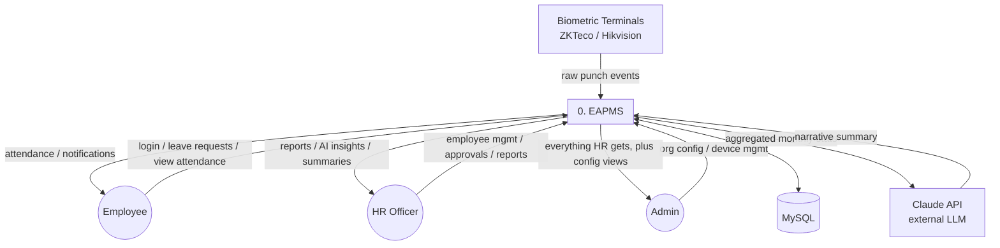
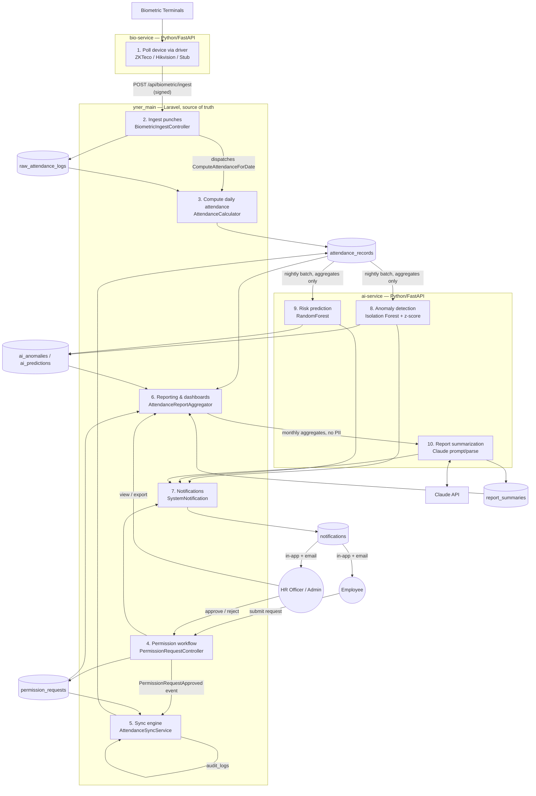

# Data Flow Diagrams

## Level 0 — Context Diagram

The whole system as a single process, showing its external actors and data stores.

## Level 1 — Process Decomposition

Breaks "0. EAPMS" into its three services and the core processes inside `yner_main`.

### Key data-flow guarantees

- **Idempotent ingestion** — `raw_attendance_logs` dedupes on `(device_serial,
  device_user_id, punched_at)`; re-polling never double-counts a punch.
- **Aggregates-only external boundary** — everything crossing into process 10 (Claude) is a
  count/rate/label, never an employee name or raw record (enforced by
  `MonthlyReportAggregator`, audited via `report_summaries.stats`).
- **Signed internal boundary** — every arrow crossing a service subgraph boundary
  (`bio-service` → `yner_main`, `yner_main` → `ai-service`) carries the `X-Internal-Secret`
  header, verified before the request reaches process logic.
