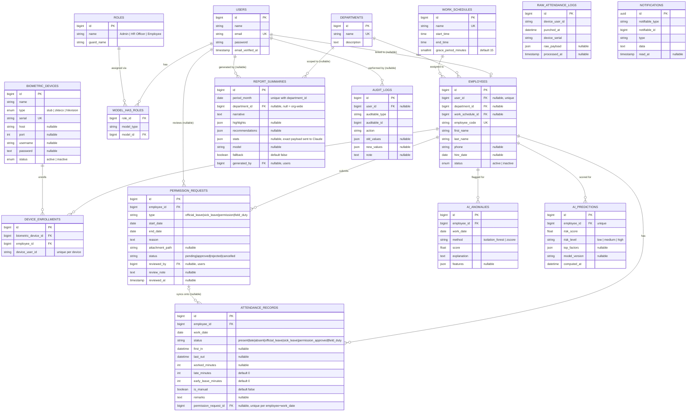

# Entity-Relationship Diagram

Built directly from `yner_main/database/migrations/*.php` — every table, column, and
foreign key below exists in the schema as shown (Spatie's `permissions`/`role_has_permissions`/
`model_has_permissions` pivot tables are omitted for readability; only `roles` and the
`model_has_roles` link to `users` are shown).

## Notable constraints

- `raw_attendance_logs` — unique on `(device_serial, device_user_id, punched_at)` so re-polling
  a device is idempotent (dedupe at ingestion).
- `attendance_records` — unique on `(employee_id, work_date)`; one row per employee per day.
- `ai_anomalies` — unique on `(employee_id, work_date, method)` so the nightly scoring job can
  upsert without duplicating flags.
- `ai_predictions` — unique on `employee_id`; only the latest risk score per employee is kept.
- `report_summaries` — unique on `(period_month, department_id)`, which is exactly the cache
  key the "Generate AI summary" action checks before calling Claude again.
