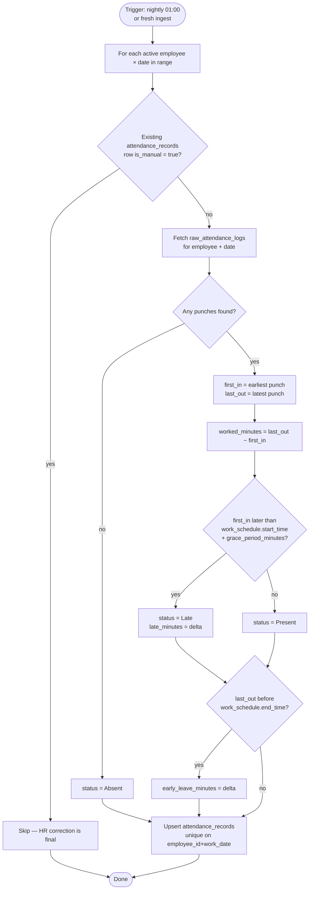
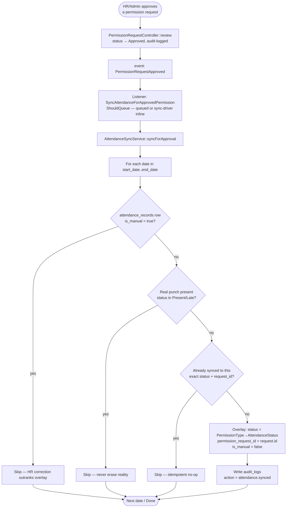

# Flowcharts

## 1. Attendance computation (Phase 4)

`App\Console\Commands\ComputeAttendance` (`attendance:compute`, scheduled daily at 01:00 for
"yesterday") drives `AttendanceCalculator` over `raw_attendance_logs` for a date/range. It is
also triggered ad-hoc: `BiometricIngestController::store` dispatches
`ComputeAttendanceForDate` for every distinct punch date in a freshly-ingested batch, so
attendance updates without waiting for the nightly run.

## 2. Approval → Sync (Phase 6 — the core innovation)

The chain that guarantees an HR-approved permission/leave overwrites a false "Absent"/null
record: `PermissionRequestController::review` → `PermissionRequestApproved` event →
`SyncAttendanceForApprovedPermission` listener (`ShouldQueue`) → `AttendanceSyncService`. The
standalone `attendance:sync-permissions` command replays this same logic over all approved
requests for retroactive backfills.

### Status mapping (`PermissionType::toAttendanceStatus`)

| Permission type | Attendance status written |
| --- | --- |
| `official_leave` | Official Leave |
| `sick_leave` | Sick Leave |
| `permission` | Permission Approved |
| `field_duty` | Field Duty |

This mapping is why the AI features (Phase 7) never mistake a synced leave day for
absenteeism — `is_leave` (used by `ai-service` feature engineering) is derived from
`status->isLeave()`, which is true for all four synced statuses.
