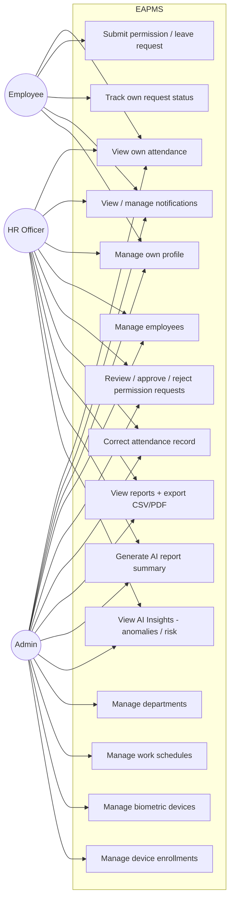

# Use-Case Diagram

Actors and use cases are derived directly from `routes/web.php`, the controllers, and the
policies that gate them (`DepartmentPolicy`, `EmployeePolicy`, `WorkSchedulePolicy`,
`PermissionRequestPolicy`, `BiometricDevicePolicy`, `DeviceEnrollmentPolicy`,
`AttendanceRecordPolicy`, `ReportSummaryPolicy`, `AiAnomalyPolicy`) plus the `viewReports` Gate.

## Actor summary

| Actor | Can do | Cannot do |
| --- | --- | --- |
| **Employee** | View own attendance grid, submit/edit/cancel own *pending* permission requests, view own notifications, edit own profile | See other employees' data, review/approve requests, correct attendance, access reports/AI pages, manage departments/schedules/devices |
| **HR Officer** | Everything an Employee can on their own scope, **plus**: full employee CRUD (`EmployeePolicy` — create/update; delete is Admin-only), review/approve/reject any permission request, manually correct attendance, view reports + export, generate AI summaries, view AI Insights | Delete an employee, manage departments/work-schedules/biometric devices/enrollments (Admin-only per `DepartmentPolicy`/`WorkSchedulePolicy`/`BiometricDevicePolicy`) |
| **Admin** | Everything HR can, **plus**: department CRUD, work-schedule CRUD, biometric device CRUD, device-enrollment CRUD, delete employees | — (full system access) |

Note: `PermissionRequestPolicy::review` and `::update` are additionally time-gated — a
request can only be edited by its owner or reviewed by HR/Admin while `status = pending`.
